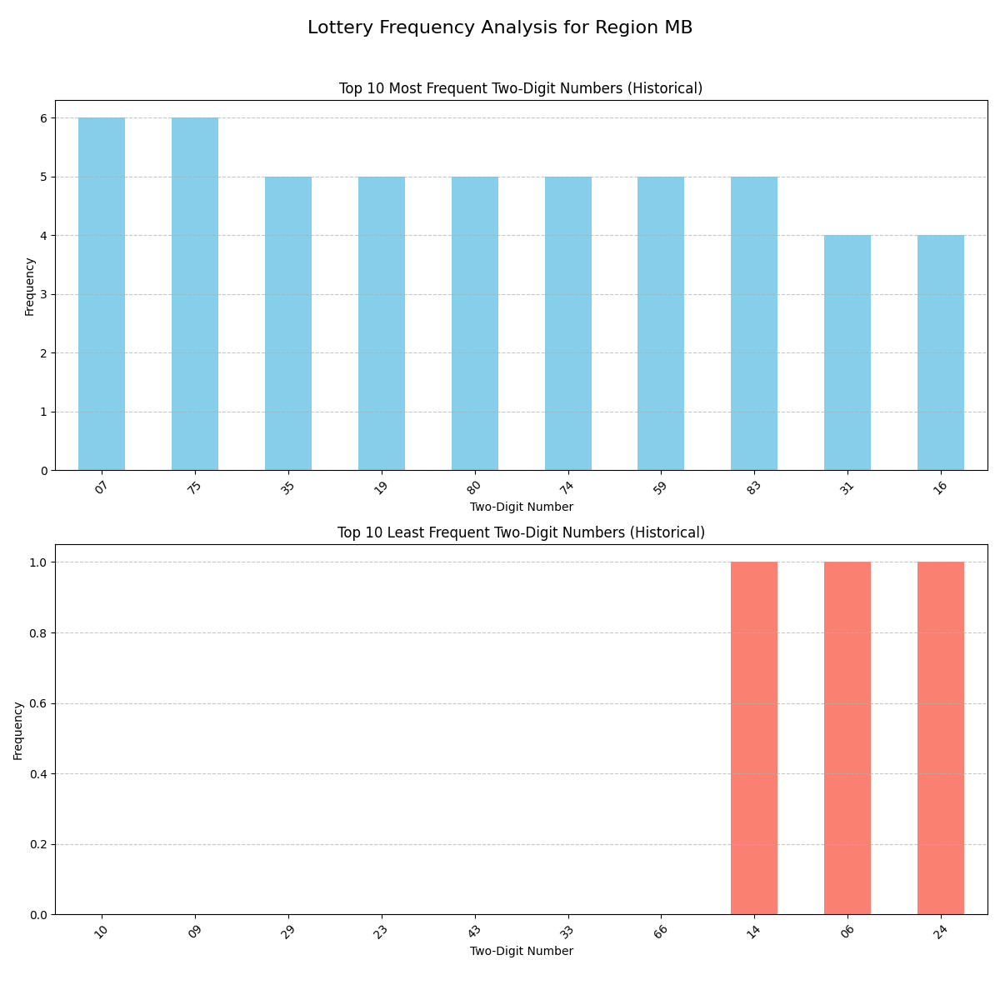
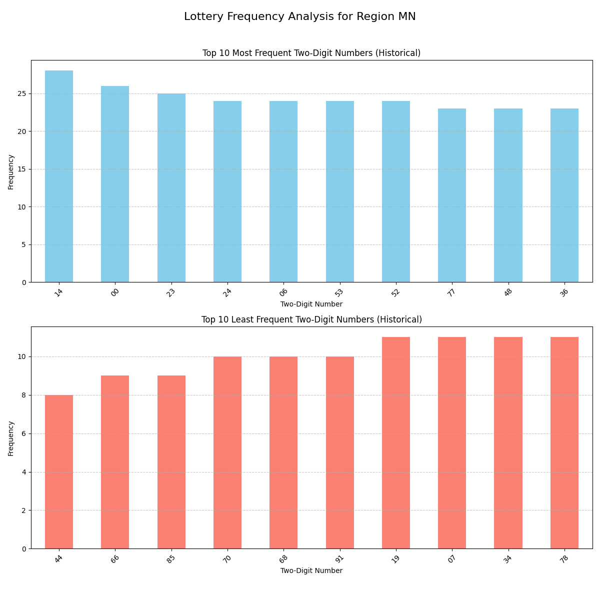
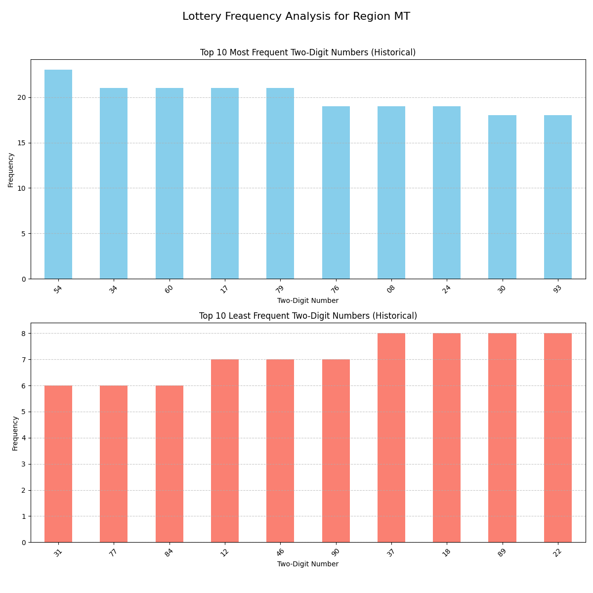
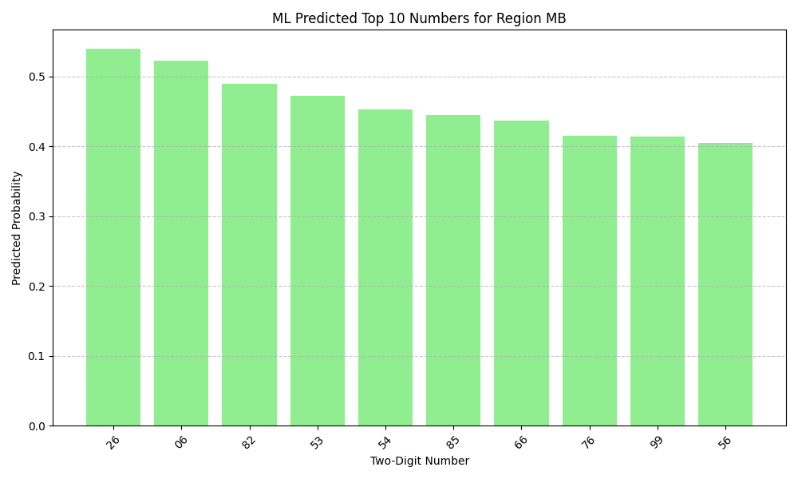
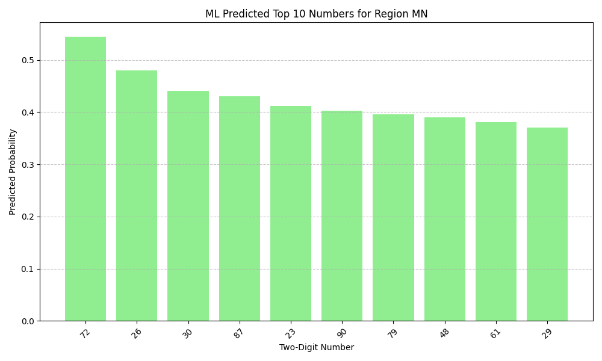
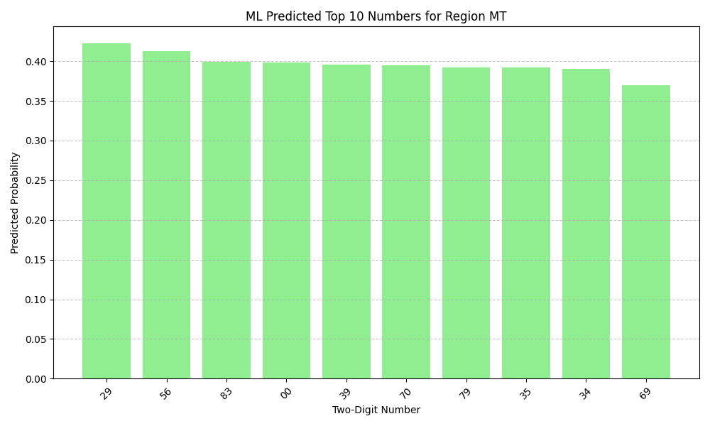

# Vietnam Lottery Data Fetcher

Công cụ tự động thu thập, xử lý và lưu trữ dữ liệu xổ số từ ba miền của Việt Nam (Bắc, Trung, Nam).

## Tính năng

- Thu thập kết quả xổ số Miền Bắc (XSMB), Miền Nam (XSMN) và Miền Trung (XSMT).
- Tự động điều chỉnh ngày thu thập dựa trên múi giờ Việt Nam để đảm bảo dữ liệu đầy đủ.
- Lưu trữ dữ liệu dưới nhiều định dạng:
    - Dữ liệu thô (raw data) dưới dạng JSON và CSV/Parquet.
    - Dữ liệu 2 số cuối (2-digits data) dưới dạng CSV/Parquet, phục vụ phân tích.
    - Dữ liệu dạng ma trận thưa (sparse data) dưới dạng CSV/Parquet, tối ưu cho các phân tích chuyên sâu.
- Hỗ trợ thu thập dữ liệu theo khoảng thời gian tùy chỉnh.
- Gửi thông báo trạng thái qua Telegram (tùy chọn cấu hình).
- Tự động cập nhật dữ liệu hàng ngày thông qua GitHub Actions.

## Yêu cầu hệ thống

- Python 3.13 trở lên
- Các thư viện Python được liệt kê trong `requirements.txt`

## Cài đặt

1. Clone repository này về máy:
```bash
git clone https://github.com/[username]/vietnam-lottery.git
cd vietnam-lottery
```

2. Cài đặt các thư viện cần thiết:
```bash
pip install -r requirements.txt
```

## Cách sử dụng

### Thu thập dữ liệu thủ công

Script chính `src/fetch.py` cho phép thu thập dữ liệu từ cả ba miền. Bạn có thể chỉ định ngày bắt đầu và ngày kết thúc để thu thập dữ liệu.

- **Chạy từ dòng lệnh:**
  Để thu thập dữ liệu cho một khoảng thời gian cụ thể:
  ```bash
  python -m src.fetch --start YYYY-MM-DD --end YYYY-MM-DD
  ```
  Ví dụ:
  ```bash
  python -m src.fetch --start 2023-01-01 --end 2023-01-31
  ```
  Nếu không cung cấp ngày, script sẽ mặc định thu thập dữ liệu trong 7 ngày gần nhất tính đến ngày hiện tại (có điều chỉnh theo múi giờ Việt Nam để đảm bảo dữ liệu đầy đủ).

- **Sử dụng trong mã Python:**
  ```python
  from datetime import date
  from src.fetch import fetch_xsmb, fetch_xsmn, fetch_xsmt # Lưu ý: các hàm này không còn được export trực tiếp từ fetch.py để sử dụng bên ngoài.
                                                          # Thay vào đó, bạn nên chạy script fetch.py như một module.
  # Ví dụ (chỉ mang tính minh họa, không khuyến khích sử dụng trực tiếp các hàm nội bộ):
  # from src.lotterymb import LotteryMB
  # from src.lotterymn import LotteryMN
  # from src.lotterymt import LotteryMT
  # from src.fetch import _fetch_lottery_data # Hàm nội bộ

  # start_date = date(2023, 1, 1)
  # end_date = date(2023, 12, 31)

  # _fetch_lottery_data(LotteryMB(), 'XSMB', start_date, end_date)
  # _fetch_lottery_data(LotteryMN(), 'XSMN', start_date, end_date)
  # _fetch_lottery_data(LotteryMT(), 'XSMT', start_date, end_date)
  ```

### Cấu hình thông báo Telegram

Bạn có thể nhận thông báo về trạng thái cập nhật dữ liệu qua Telegram bằng cách thiết lập các biến môi trường sau:

- `TELEGRAM_BOT_TOKEN`: Token của bot Telegram của bạn.
- `TELEGRAM_CHAT_ID`: ID cuộc trò chuyện (chat ID) nơi bot sẽ gửi thông báo.

Ví dụ, bạn có thể tạo một file `.env` trong thư mục gốc của dự án với nội dung:
```
TELEGRAM_BOT_TOKEN=YOUR_BOT_TOKEN_HERE
TELEGRAM_CHAT_ID=YOUR_CHAT_ID_HERE
```
Sau đó, đảm bảo rằng thư viện `python-dotenv` đã được cài đặt (`pip install python-dotenv`).

## Cấu trúc dự án

## Phân tích tần suất lịch sử

Dưới đây là phân tích tần suất xuất hiện của 10 số có 2 chữ số cao nhất và 10 số thấp nhất dựa trên dữ liệu lịch sử cho từng miền:

### Miền Bắc (XSMB)


### Miền Nam (XSMN)


### Miền Trung (XSMT)


## Dự đoán kết quả (Machine Learning)

Dưới đây là dự đoán 10 số có 2 chữ số có khả năng ra cao nhất dựa trên mô hình Machine Learning (Hồi quy Logistic) được huấn luyện từ dữ liệu lịch sử. Kết quả được sắp xếp theo xác suất dự đoán giảm dần.

### Miền Bắc (XSMB)


### Miền Nam (XSMN)


### Miền Trung (XSMT)



```
vietnam-lottery/
├── .github/                  # Cấu hình GitHub Actions
│   └── workflows/
│       └── update-data.yml   # Workflow tự động cập nhật dữ liệu
├── data/                     # Thư mục chứa dữ liệu xổ số đã thu thập
│   └── analysis/             # (Có thể chứa các script hoặc kết quả phân tích)
├── requirements.txt          # Các thư viện Python cần thiết
├── src/
│   ├── fetch.py              # Script chính để thu thập dữ liệu
│   ├── lottery_analyzer.py   # Script phân tích tần suất và dự đoán kết quả
│   ├── lottery_base.py       # Lớp cơ sở trừu tượng cho các loại xổ số
│   ├── lotterymb.py          # Module xử lý xổ số Miền Bắc
│   ├── lotterymn.py          # Module xử lý xổ số Miền Nam
│   ├── lotterymt.py          # Module xử lý xổ số Miền Trung
│   └── models/               # Định nghĩa các Pydantic model cho dữ liệu
│       ├── lottery_mb.py
│       ├── lottery_mn.py
│       └── lottery_mt.py
└── README.md                 # File hướng dẫn sử dụng dự án
```

## Thư viện sử dụng

- `beautifulsoup4`: Phân tích cú pháp HTML từ các trang web.
- `cloudscraper`: Xử lý các biện pháp bảo vệ website (như Cloudflare) để thu thập dữ liệu.
- `numpy`: Hỗ trợ các phép toán số học hiệu quả.
- `pandas`: Xử lý, phân tích và lưu trữ dữ liệu dưới dạng DataFrame.
- `pydantic`: Kiểm tra và xác thực dữ liệu, đảm bảo tính toàn vẹn của dữ liệu xổ số.
- `requests`: Thực hiện các yêu cầu HTTP (được sử dụng bởi `cloudscraper` và cho thông báo Telegram).
- `python-dotenv`: Tải các biến môi trường từ file `.env`.
- `lxml`: Bộ phân tích cú pháp HTML/XML nhanh chóng (được được sử dụng bởi `beautifulsoup4`).
- `matplotlib`: Thư viện để tạo biểu đồ và trực quan hóa dữ liệu.
- `scikit-learn`: Thư viện cho các thuật toán học máy, được sử dụng để xây dựng mô hình dự đoán.

## Tự động cập nhật dữ liệu

Dự án này tích hợp GitHub Actions để tự động thu thập và cập nhật dữ liệu xổ số hàng ngày.

- **Lịch trình:** Workflow `update-data.yml` được cấu hình để chạy vào lúc 18:45 (giờ Việt Nam) mỗi ngày.
- **Kích hoạt thủ công:** Bạn cũng có thể kích hoạt workflow này thủ công thông qua giao diện GitHub Actions.
- **Cách hoạt động:** Workflow sẽ checkout mã nguồn, cài đặt các thư viện, chạy script `src/fetch.py` để thu thập dữ liệu mới nhất, sau đó commit và push các thay đổi dữ liệu trở lại repository.

Để workflow hoạt động, bạn cần cấu hình một `GITHUB_TOKEN` với quyền `contents: write` trong repository của mình.

## Đóng góp

Mọi đóng góp đều được hoan nghênh. Vui lòng tạo issue hoặc pull request nếu bạn muốn cải thiện dự án.

## License

[Thêm thông tin về license của dự án]