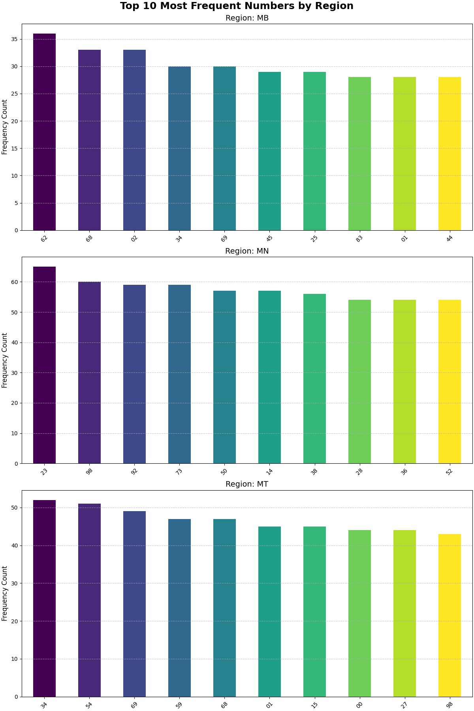
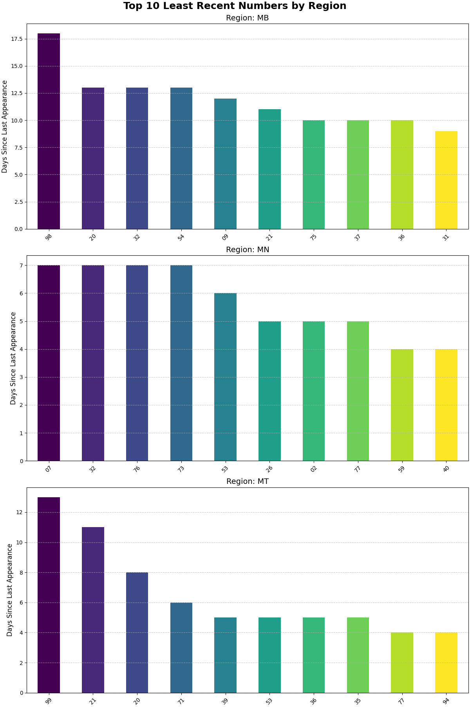

# Vietnam Lottery Data Fetcher

Công cụ tự động thu thập, xử lý và lưu trữ dữ liệu xổ số từ ba miền của Việt Nam (Bắc, Trung, Nam).

## Tính năng

- Thu thập kết quả xổ số Miền Bắc (XSMB), Miền Nam (XSMN) và Miền Trung (XSMT).
- Tự động điều chỉnh ngày thu thập dựa trên múi giờ Việt Nam để đảm bảo dữ liệu đầy đủ.
- Lưu trữ dữ liệu dưới nhiều định dạng:
  - Dữ liệu thô (raw data) dưới dạng JSON và CSV/Parquet.
  - Dữ liệu 2 số cuối (2-digits data) dưới dạng CSV/Parquet, phục vụ phân tích.
  - Dữ liệu dạng ma trận thưa (sparse data) dưới dạng CSV/Parquet, tối ưu cho các phân tích chuyên sâu.
- Hỗ trợ thu thập dữ liệu theo khoảng thời gian tùy chỉnh.

- Tự động cập nhật dữ liệu hàng ngày thông qua GitHub Actions.

## Yêu cầu hệ thống

- Python 3.13 trở lên
- Các thư viện Python được liệt kê trong `requirements.txt`

## Cài đặt

1. Clone repository này về máy:

```bash
git clone https://github.com/[username]/vietnam-lottery.git
cd vietnam-lottery
```

2. Cài đặt các thư viện cần thiết:

```bash
pip install -r requirements.txt
```

## Cách sử dụng

Dự án này cung cấp hai script chính để bạn tương tác: `fetch.py` để thu thập dữ liệu và `lottery_analyzer.py` để phân tích và tạo biểu đồ dự đoán.

### 1. Thu thập dữ liệu (Bắt buộc)

Đây là bước đầu tiên và quan trọng nhất. Bạn cần thu thập dữ liệu xổ số trước khi có thể thực hiện bất kỳ phân tích nào.

- **Chạy từ dòng lệnh:**
  Script `src/fetch.py` cho phép thu thập dữ liệu từ cả ba miền.
  - Để thu thập dữ liệu trong 7 ngày gần nhất (mặc định):
    ```bash
    python -m src.fetch
    ```
  - Để thu thập dữ liệu cho một khoảng thời gian cụ thể:
    ```bash
    python -m src.fetch --start YYYY-MM-DD --end YYYY-MM-DD
    ```
    Ví dụ:
    ```bash
    python -m src.fetch --start 2023-01-01 --end 2023-12-31
    ```
    Script sẽ tự động lưu dữ liệu vào thư mục `data/` dưới nhiều định dạng khác nhau (JSON, Parquet, CSV).

### 2. Phân tích và Dự đoán

Sau khi đã có dữ liệu, bạn có thể chạy script `lottery_analyzer.py` để tạo các biểu đồ phân tích tần suất và dự đoán bằng Machine Learning.

- **Chạy từ dòng lệnh:**
  ```bash
  python -m src.lottery_analyzer
  ```
- **Kết quả:**
  Script này sẽ:
  1. Đọc dữ liệu từ các file `*-2-digits.csv` trong thư mục `data/`.
  2. Thực hiện phân tích tần suất và huấn luyện mô hình dự đoán.
  3. Lưu các biểu đồ phân tích và dự đoán (dưới dạng file `.png`) vào thư mục `data/`. Các biểu đồ này chính là những hình ảnh bạn thấy trong phần "Phân tích và Dự đoán Kết quả" của file README này.

## Cấu trúc dự án

```
vietnam-lottery/
├── .github/                  # Cấu hình GitHub Actions
│   └── workflows/
│       └── update-data.yml   # Workflow tự động cập nhật dữ liệu
├── data/                     # Thư mục chứa dữ liệu xổ số đã thu thập
│   └── analysis/             # (Có thể chứa các script hoặc kết quả phân tích)
├── requirements.txt          # Các thư viện Python cần thiết
├── src/
│   ├── fetch.py              # Script chính để thu thập dữ liệu
│   ├── lottery_analyzer.py   # Script phân tích tần suất và dự đoán kết quả
│   ├── lottery_base.py       # Lớp cơ sở trừu tượng cho các loại xổ số
│   ├── lotterymb.py          # Module xử lý xổ số Miền Bắc
│   ├── lotterymn.py          # Module xử lý xổ số Miền Nam
│   ├── lotterymt.py          # Module xử lý xổ số Miền Trung
│   └── models/               # Định nghĩa các Pydantic model cho dữ liệu
│       ├── lottery_mb.py
│       ├── lottery_mn.py
│       └── lottery_mt.py
└── README.md                 # File hướng dẫn sử dụng dự án
```

## Thư viện sử dụng

- `beautifulsoup4`: Phân tích cú pháp HTML từ các trang web.
- `cloudscraper`: Xử lý các biện pháp bảo vệ website (như Cloudflare) để thu thập dữ liệu.
- `numpy`: Hỗ trợ các phép toán số học hiệu quả.
- `pandas`: Xử lý, phân tích và lưu trữ dữ liệu dưới dạng DataFrame.
- `pydantic`: Kiểm tra và xác thực dữ liệu, đảm bảo tính toàn vẹn của dữ liệu xổ số.
- `requests`: Thực hiện các yêu cầu HTTP (được sử dụng bởi `cloudscraper`).
- `lxml`: Bộ phân tích cú pháp HTML/XML nhanh chóng (được được sử dụng bởi `beautifulsoup4`).
- `matplotlib`: Thư viện để tạo biểu đồ và trực quan hóa dữ liệu.
- `scikit-learn`: Thư viện cho các thuật toán học máy, được sử dụng để xây dựng mô hình dự đoán.

## Tự động cập nhật dữ liệu

Dự án này tích hợp GitHub Actions để tự động thu thập và cập nhật dữ liệu xổ số hàng ngày.

- **Lịch trình:** Workflow `update-data.yml` được cấu hình để chạy vào lúc 18:45 (giờ Việt Nam) mỗi ngày.
- **Kích hoạt thủ công:** Bạn cũng có thể kích hoạt workflow này thủ công thông qua giao diện GitHub Actions.
- **Cách hoạt động:** Workflow sẽ checkout mã nguồn, cài đặt các thư viện, chạy script `src/fetch.py` để thu thập dữ liệu mới nhất, sau đó commit và push các thay đổi dữ liệu trở lại repository.

Để workflow hoạt động, bạn cần cấu hình một `GITHUB_TOKEN` với quyền `contents: write` trong repository của mình.

## Đóng góp

Mọi đóng góp đều được hoan nghênh. Vui lòng tạo issue hoặc pull request nếu bạn muốn cải thiện dự án.

## License

[Thêm thông tin về license của dự án]

## Phân tích Kết quả

Phần này cung cấp các phân tích về những con số xuất hiện thường xuyên nhất và những con số đã lâu không xuất hiện.

### Các số xuất hiện nhiều nhất theo từng vùng miền


### Các số lâu rồi không xuất hiện theo từng vùng miền

